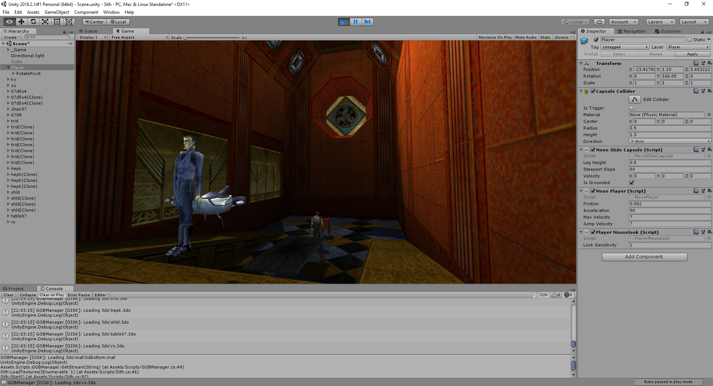

# OpenSith
OpenSith is an engine reimplementation of Star Wars: Jedi Knight Dark Forces II in Unity.

## What works
Rendering of .JKL-levels, rendering and animating .3DO-models and textures.

There is no .COG-parser, nor is there any COG virtual machine. As such, the game is not playable in its current state. It's possible to run around a level though.

## How do I run it?
1. Open the "Scene" scene in Unity.
2. Find the gameobject called "_Game" and set the "Game Path" property to your JK install directory.

OpenSith can parse both the .GOB-archives of the Steam version as well as extracted files on your hard drive. If an extracted file from a GOB exists in a subdirectory called "Extracted" of your Game Path, OpenSith will load that file instead. This is nice if you want to tweak the files and test without having to put them in a GOB first!

## How do I contribute?
Fork this repository. Look in the Issues list. Communicate that you're committing to fixing an issue and finally submit a pull request.

## Why?
For fun - just as all programming should be.

Just like [Open76](https://github.com/r1sc/Open76), Jedi Knight suffers from an aging engine. In recent years it has become increasingly harder to play it on modern platforms.
The primary goal of this project is to provide the same playing experience in a modern engine while conforming to the original data file specifications.
A long term goal is to extend the engine with various modern features, such as HMD and VR support.

## More screenshots

## License
Licensed under the GPL version 3.

This is in **no way** affiliated with or endorsed by LucasArts, EA or any other company.